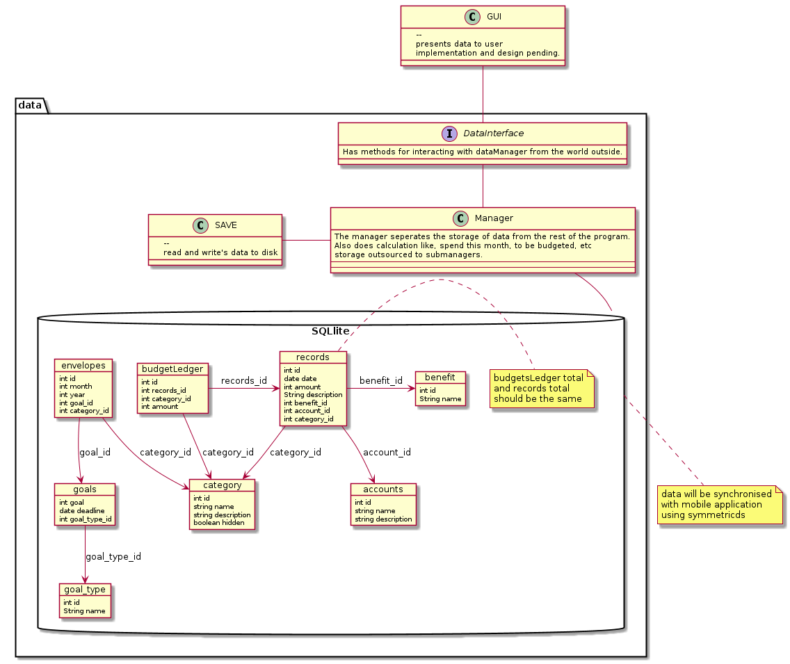

Apparently, I did not do enough research before starting this project. 

This resulted in a lot of unnecessary code and unfocused work. 

This document is an attempt to decide on several technologies and frameworks in order to choose carefully on what to use

# Storage

Storage is a big problem here. As we need to have both an desktop as an mobile application that shares an database. Due to the nature of the data, it is not feasible to store it 'in the cloud', or as I like to call it 'someone else computer'. 

We need to investigate several storage solutions to see what is suitable for us.  

We researched the following solutions:
- SQL-lite with symmetricsds
	- easy storage
	- symmetricsds provides 2-way synchronization. 
- XML
	- portable
	- plain text
	- no 2-way sync
- ledger-cli file format
	- portable
	- human readable
	- git-diff does work

I have decided to use SQL lite with symmetricsds for synchronization. 
It makes storage a lot easier. 
My project has a need for the 'relational' part of databases. 

With XML, I would need to implement that 'relational' myself (probably badly)

With the ledger-cli file format, I would have to implement writers and parsing myself.

Those file formats can still be supported in the future. 
Right now I should focus on a producing a first working version of this software.

# GUI

There are several GUI I could use. 

- javaFX

JavaFX makes it easy to create a GUI quickly. It is suitable for desktop usage. 

- Command line interface

An command line interface should be included for debugging and scripting purposes. 

- standard web framework

The application can provide an Restful interface so that web developers can easily create an GUI for it. 
A friend of mine has offered to help with the GUI, provided that I give him an interface. 

I have not decided yet on what tech to use for the GUI. Ideally, I would implement all of the above.

## Class structure

Always handy to have an proposed class overview. 

